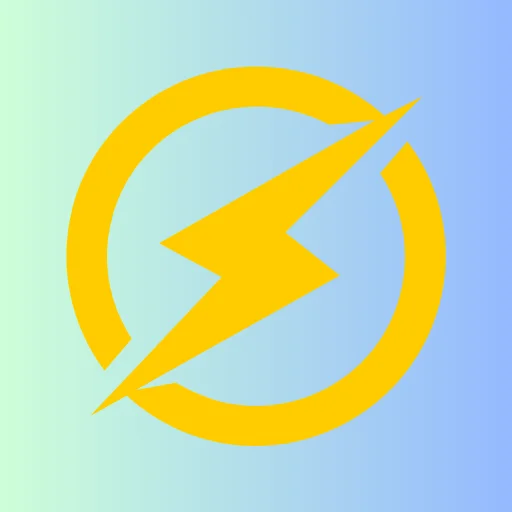
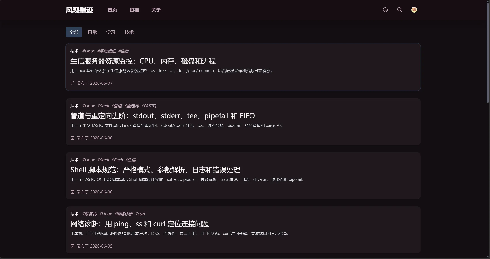
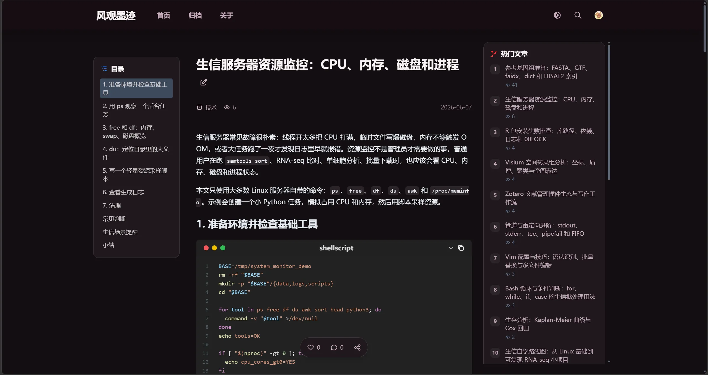
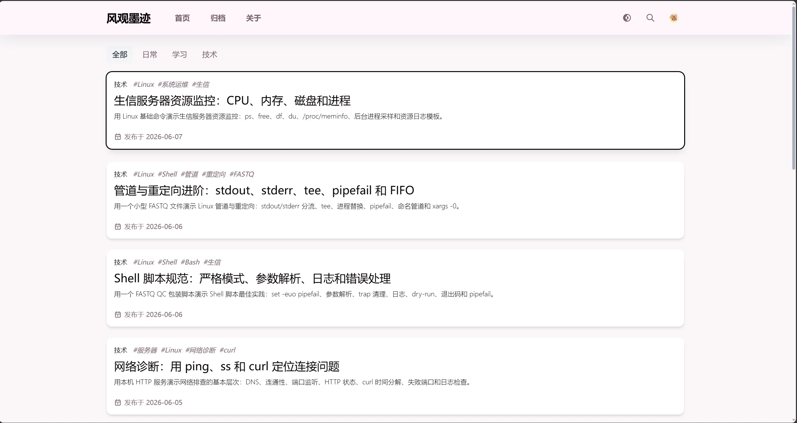
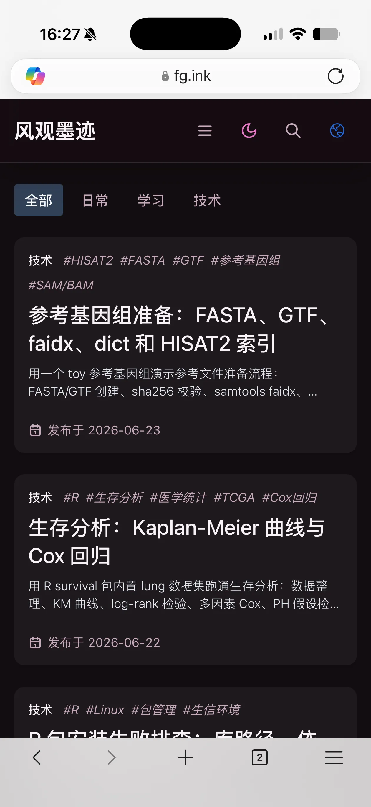
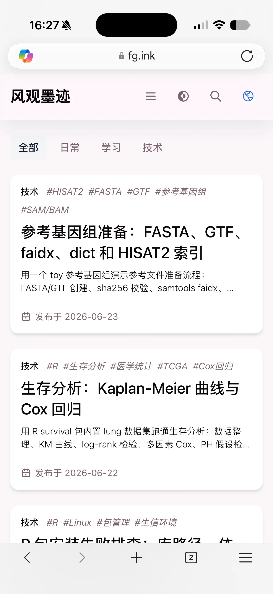
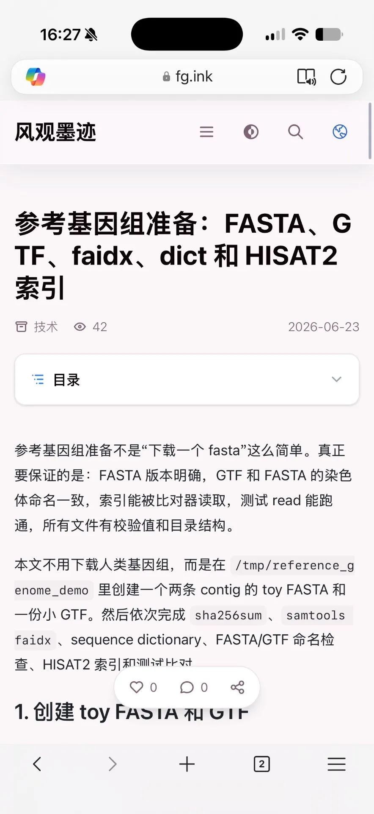
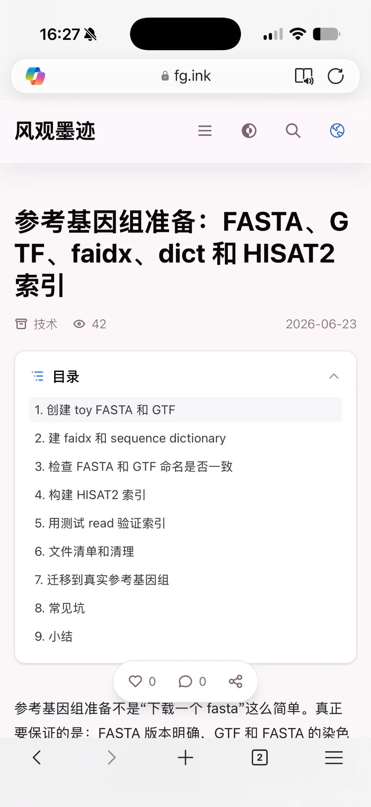
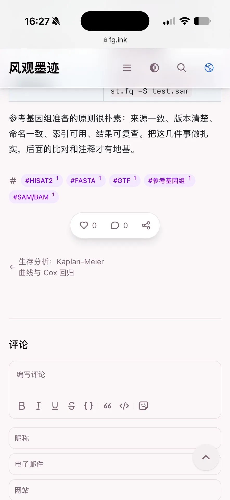

<p align="center">
  
</p>

<h1 align="center">Earthquake</h1>

<p align="center">
  <strong>基于 Earth 二开的 Halo 主题</strong> · 轻量 · 有态度
</p>

<p align="center">
  <a href="https://fg.ink">在线预览</a> ·
  <a href="https://github.com/mufengyian/theme-earthquake/releases">Releases</a> ·
  <a href="https://github.com/mufengyian/theme-earthquake/issues">Issues</a>
</p>

---

## 预览

### 桌面端

<table>
  <tr>
    <td width="50%"></td>
    <td width="50%"></td>
  </tr>
  <tr>
    <td width="50%"></td>
    <td width="50%"></td>
  </tr>
</table>

### 移动端

<table>
  <tr>
    <td width="33%"></td>
    <td width="33%"></td>
    <td width="33%"></td>
  </tr>
  <tr>
    <td width="33%"></td>
    <td width="33%"></td>
    <td width="33%"></td>
  </tr>
</table>

---

## 特性

- **现代技术栈** — Astro 6 + Tailwind CSS 4 + Alpine.js + TypeScript
- **OKLCH 色彩系统** — 单 hue 变量驱动 35+ 主题预设
- **Pjax 无刷新导航** — 页面切换不重载，带进度条动画
- **暗色/亮色模式** — 支持跟随系统、手动切换、切换动画
- **毛玻璃导航栏** — 可配置透明度与模糊度
- **阅读进度条** — 页面顶部显示阅读进度
- **代码高亮** — 通过 plugin-shiki 提供 Shiki 高亮，暗色亮色自动跟随
- **图片预览** — 文章图片点击放大，支持图库模式与 EXIF 信息
- **SEO** — Open Graph / Twitter Card / JSON-LD / Canonical
- **国际化** — 支持多语言（当前 zh_CN）
- **响应式设计** — 桌面端 + 移动端全面适配
- **站点统计** — 侧边栏显示文章数、评论数、访问量、运行天数
- **分享功能** — 支持 X / Telegram / QQ / 微信 / 微博 等平台
- **技术栈** — 基于 Astro 6 + Tailwind CSS 4 + Alpine.js + TypeScript 构建

## 插件依赖

所有插件均为可选，不安装则不会出现对应功能：

| 插件 | 用途 |
|------|------|
| [plugin-comment-widget](https://github.com/halo-sigs/plugin-comment-widget) | 评论系统 |
| [plugin-search-widget](https://github.com/halo-sigs/plugin-search-widget) | 搜索功能 |
| [plugin-shiki](https://github.com/halo-sigs/plugin-shiki) | 代码语法高亮 |
| [plugin-links](https://github.com/halo-sigs/plugin-links) | 友链页面 |
| [plugin-photos](https://github.com/halo-sigs/plugin-photos) | 图库页面 |
| [plugin-moments](https://github.com/halo-sigs/plugin-moments) | 瞬间页面 |

## 快速开始

```bash
# 克隆
git clone https://github.com/mufengyian/theme-earthquake.git
cd theme-earthquake

# 安装依赖
pnpm install

# 开发
pnpm dev

# 构建
pnpm build

# 打包（生成 Halo 主题 zip）
pnpm package
```

构建产物位于 `dist/` 目录，生成的 `.zip` 文件可直接上传至 Halo 后台 → 主题。

## 自定义

### 主题样式

Halo 后台 → 主题 → 设置 → 样式

- **主题样式**：35+ 预设配色（默认、天蓝、靛蓝、翡翠、樱花粉等）
- **字体**：系统默认 / 思源黑体 / 思源宋体 / 文楷
- **代码高亮**：独立设置亮色/暗色模式下的 highlight.js 主题

### 侧边栏

Halo 后台 → 主题 → 设置 → 侧边栏

- 站点资料：头像、简介、社交链接
- 站点统计：文章数、评论数、访问量、运行天数
- 热门文章、分类、标签

## 技术栈

| 技术 | 用途 |
|------|------|
| [Astro](https://astro.build) | 静态站点生成器 |
| [Tailwind CSS 4](https://tailwindcss.com) | 样式框架 |
| [Alpine.js](https://alpinejs.dev) | 前端交互 |
| [plugin-shiki](https://github.com/halo-sigs/plugin-shiki) | 代码语法高亮（需安装） |
| [TypeScript](https://typescriptlang.org) | 类型安全 |
| [Iconify](https://iconify.design) | SVG 图标库 |
| [OKLCH](https://oklch.com) | 现代色彩空间 |

## License

[GPL-3.0](LICENSE)